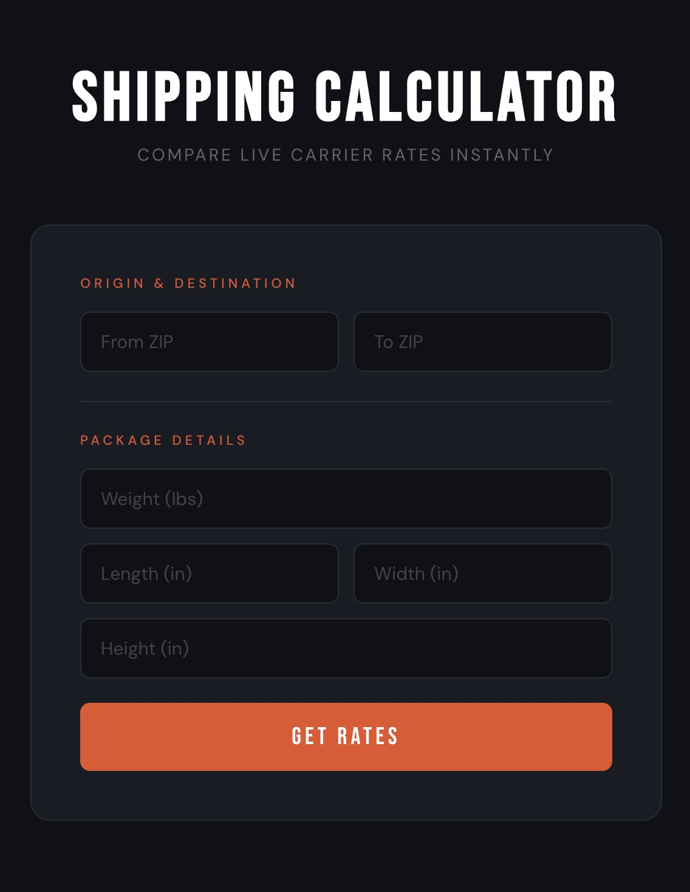
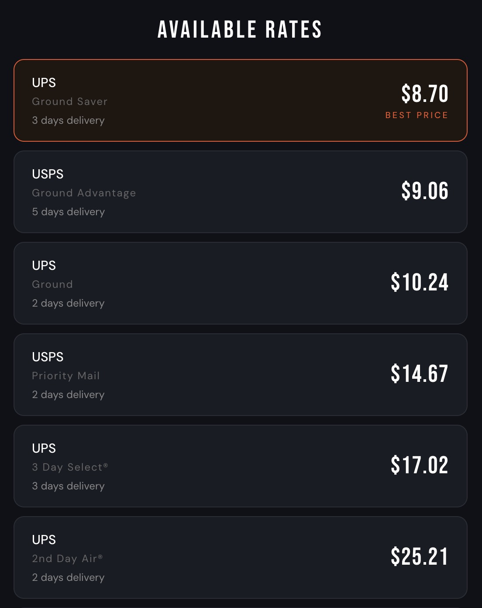

# Shipping Rate Calculator

A full-stack web app that fetches live shipping rates from multiple carriers in real time. Enter an origin ZIP, destination ZIP, and package dimensions — get back every available rate sorted by price, with the cheapest option highlighted.





---

## Features

- **Live carrier rates** — queries the Shippo API to return real-time pricing from UPS, USPS, FedEx, and other carriers simultaneously
- **Side-by-side comparison** — results are sorted cheapest-first so the best value is always at the top
- **Estimated delivery times** — each rate card shows the expected transit days alongside the price
- **Input validation** — catches missing fields, invalid ZIP codes, and non-positive dimensions before making any API call
- **Dark, minimal UI** — custom CSS design with no component library dependencies

---

## Tech Stack

| Layer | Technology |
|---|---|
| Frontend | React 19 |
| Backend | Node.js, Express 5 |
| Shipping API | [Shippo](https://goshippo.com/) |
| Styling | Custom CSS (Google Fonts: Bebas Neue, DM Sans) |

---

## Architecture

```
shipping-calculator/
├── client/          # React frontend (port 3000)
│   └── src/
│       └── App.js   # Single-component UI with all form logic
└── server/          # Express backend (port 5001)
    └── index.js     # POST /api/rates — proxies requests to Shippo
```

The frontend never touches the Shippo API directly. All requests go through the Express server, which keeps the API key server-side and out of the browser.

---

## Getting Started

### Prerequisites

- Node.js v18+
- A free [Shippo account](https://goshippo.com/) (test API key works for development)

### Installation

1. Clone the repository:
   ```bash
   git clone https://github.com/YOUR_USERNAME/shipping-calculator.git
   cd shipping-calculator
   ```

2. Install dependencies for both the server and client:
   ```bash
   cd server && npm install
   cd ../client && npm install
   ```

3. Create the environment file for the server:
   ```bash
   cd ../server
   cp .env.example .env
   ```
   Then open `.env` and add your Shippo API key (see [Environment Variables](#environment-variables) below).

### Running Locally

Start the backend (from the `server/` directory):
```bash
node index.js
```

In a separate terminal, start the frontend (from the `client/` directory):
```bash
npm start
```

Open [http://localhost:3000](http://localhost:3000) in your browser.

---

## Environment Variables

The server requires one environment variable:

| Variable | Description |
|---|---|
| `SHIPPO_API_KEY` | Your Shippo API token — found in the Shippo dashboard under **API** |

Create `server/.env`:
```
SHIPPO_API_KEY=your_shippo_token_here
```

> The `.env` file is gitignored and should never be committed.

---

## How It Works

1. The user fills in the origin ZIP, destination ZIP, weight (lbs), and dimensions (inches).
2. On submit, the React frontend `POST`s to `/api/rates` on the Express server.
3. The server forwards the request to the Shippo Shipments API, which queries multiple carriers simultaneously.
4. Shippo returns a list of rate objects. The server sends them back to the client.
5. The frontend filters out any rates with null amounts, sorts by price ascending, and renders each as a rate card — the lowest-priced option is labeled **Best Price**.

---

## License

MIT
